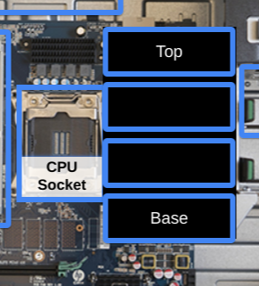
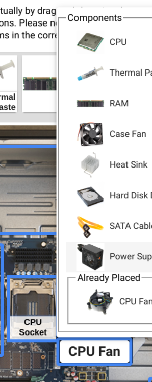
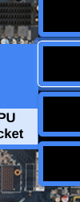
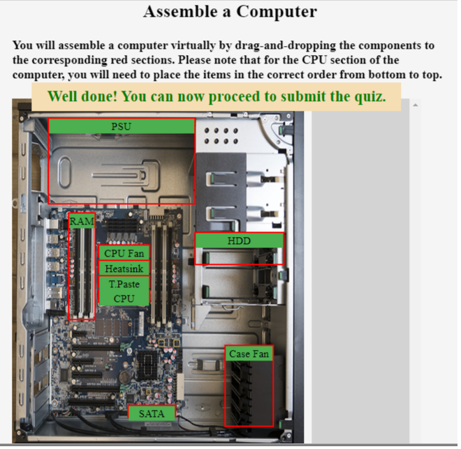

```
  # Do not copy if you are taking the test.
```
--- 

# Assemble a Computer
##### Graded Quiz • 30 min • 1 total point 
----- 
  

### 1. 
In this quiz, you will assemble a computer virtually by dragging-and-dropping the components to the corresponding  sections.

In the CPU section, you will need to place the 4 items in the correct order, from bottom to top (as shown in the picture below), as if it were a physical computer.    
   

Click the "Check" button to check your answers. Correct placements will be outlined in green, and incorrect placements will be outlined in red. If you've made a mistake, edit your placements or click the arrow to reset all placements and try again. When you're done, click the "Submit" button for a grade.

Quiz consideration:

  - To select components, drag and drop or click inside the square and choose the appropriate component from the list.   
        
  - When dropping the component into place, be sure to have a white line outlining the place where you are dropping (see picture below). 
        


1. To complete the quiz, you will need to get 100% accuracy.

1. If you choose to try the quiz again,click the “Try Again” button before continuing. If not, the plugin will allow you to practice the quiz but will not allow you to submit your grade.

1. When you’re done, make sure you have closed the fullscreen quiz and click the “Submit Quiz” button to earn a grade.

Good luck!


-----------------   

#### Solution: 
 


--- 
> [Technical Support Fundamentals](https://www.coursera.org/learn/technical-support-fundamentals/) {Week-2}
