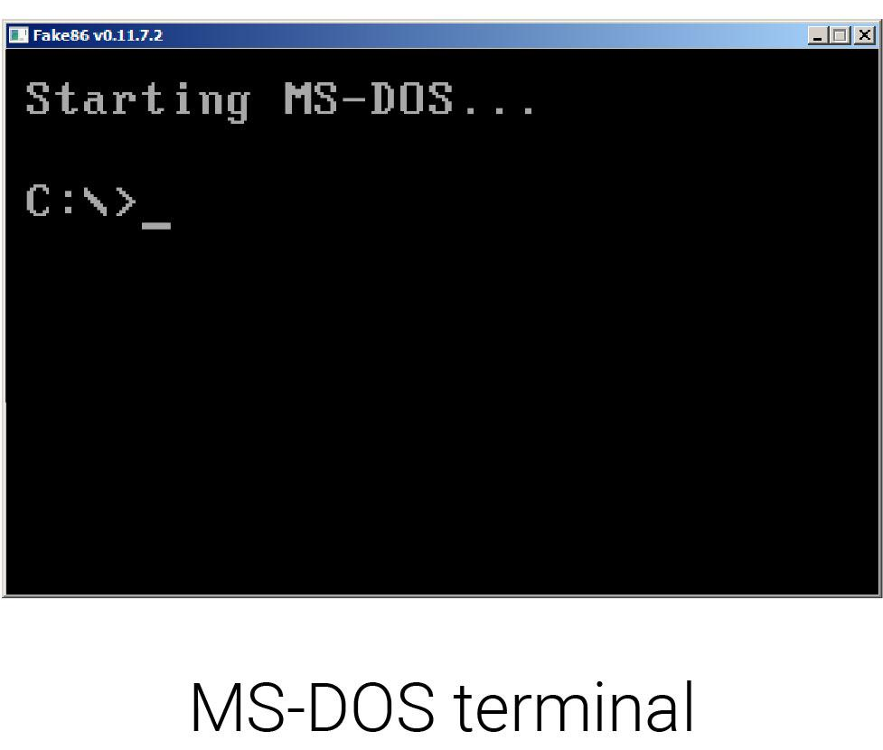
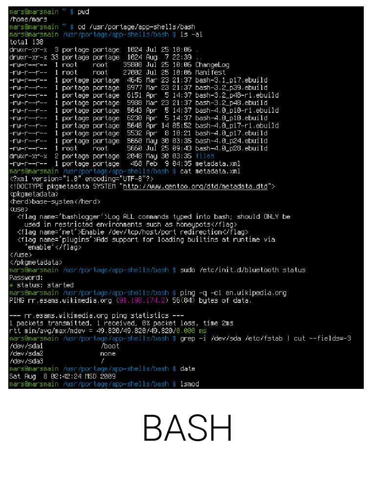
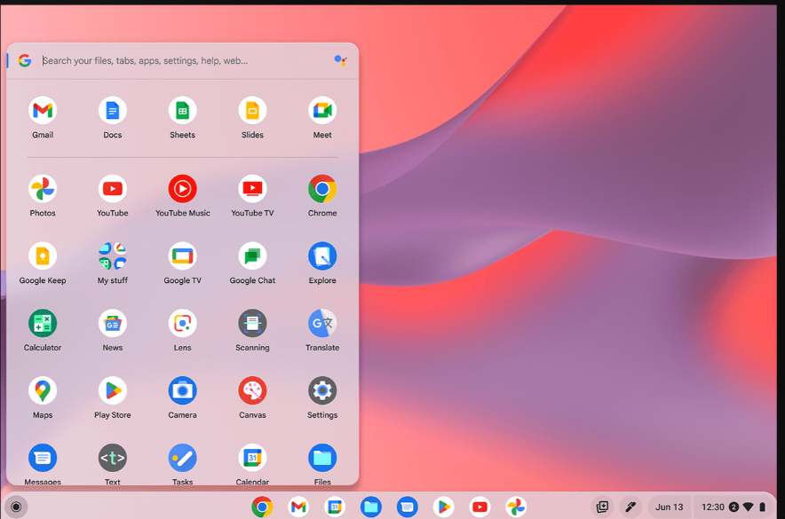
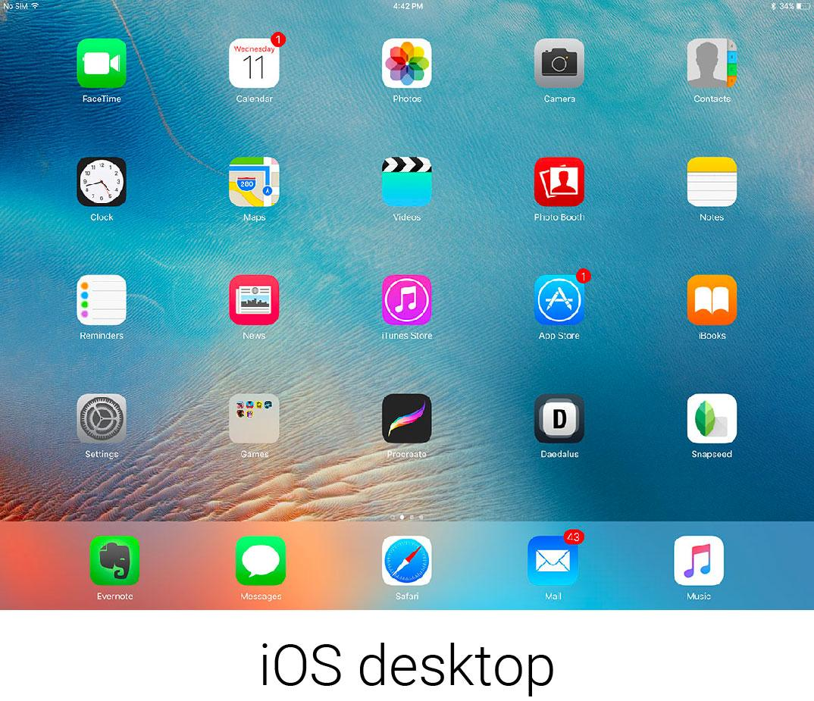

```
  # Do not copy if you are taking the test.
```
--- 

# What is an Operating System?  
##### Practice Quiz • 14 min • 5 total points 
----- 


### 01.  What are the two main parts that make up an operating system?
  
- [x] Kernel and Userspace  
- [ ] Kernel and Packages  
- [ ] Users and Software   
- [ ] Windows and Mac  


### 02.  What are the main components of file management? Check all that apply.
  
- [x] File data  
- [x] Metadata  
- [x] File system  
- [ ] NTFS  


### 03.  What is the last step in booting a computer?
  
- [x] User space is launched.    
- [ ] Perform a POST.    
- [ ] Execute the bootloader.   
- [ ] Load up drivers. 


### 04.  Which of these is a GUI? Check all that apply. 
  
- [ ] MS-DOS  
        
- [ ] BASH  
        
- [x] Chrome OS   
        
- [x] iOS   
        


### 05.  Which of these are considered I/O devices? Check all that apply.
  
- [x] Webcams  
- [x] Monitors  
- [ ] CPU   
- [x] Speakers  


--- 
> [Technical Support Fundamentals](https://www.coursera.org/learn/technical-support-fundamentals/) {Week-3}
